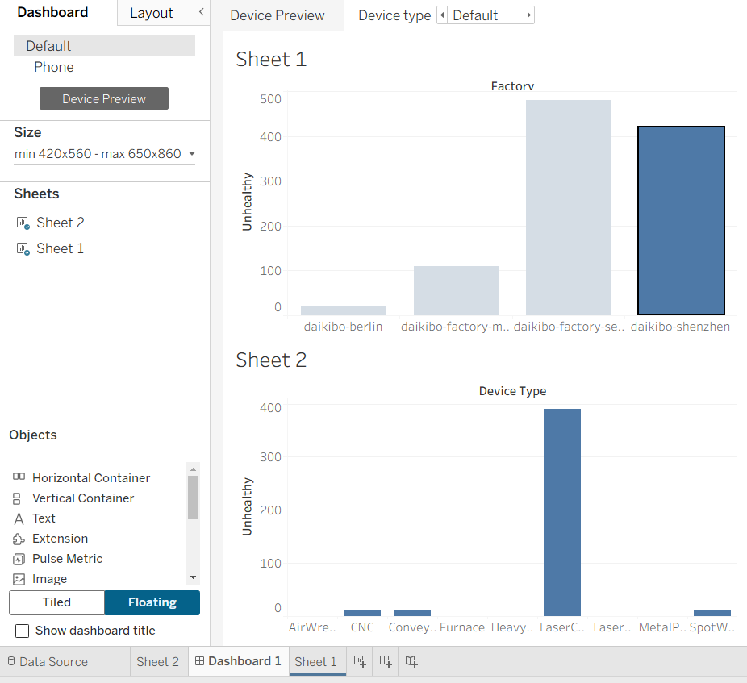

# Deloitte Australia Data Analytics Job Simulation (Forage)

## 📌 Task: Workplace Equality Classification

This project was completed as part of the Deloitte Virtual Internship on [Forage](https://www.theforage.com/).

### ✅ Deliverables
- 📊 An interactive **Power BI dashboard** for analyzing workplace equality
- 📈 Excel classification of organizations based on gender equality data
- 🧾 Final submission includes visual dashboards, Excel outputs, and summary

### 📂 Files
- Dashboard.png – Screenshot of the Power BI dashboard
- Sheet1.png, Sheet2.png – Charts based on Excel data analysis
- Task 5 Equality Table.xlsx – Final Excel with classification
- CERTIFICATE_DELOITTE.pdf – Certificate of completion

### 📷 Dashboard Preview

---

### 🔗 Certificate

---

### 💡 Tools Used
- Microsoft Excel
- Power BI
- Forage Platform
